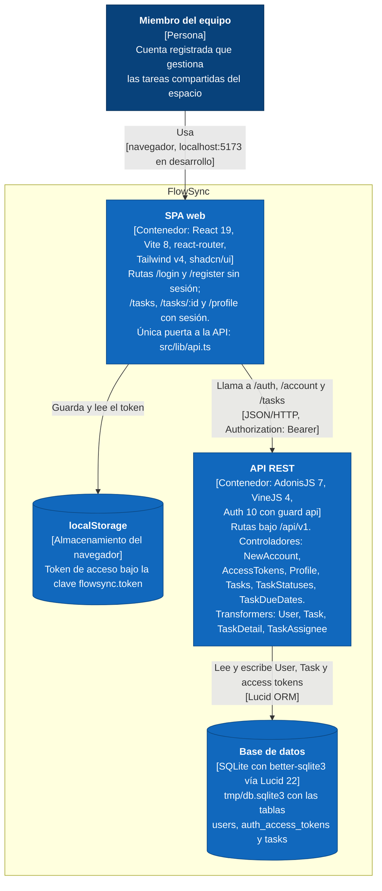

# Arquitectura de FlowSync

Diagrama de contenedores (nivel 2 de C4, dibujado como `flowchart` para que lo pinte cualquier visor de Mermaid) de FlowSync tal y como está hoy en el código. La SPA en React (`frontend/`) se ejecuta en el navegador y guarda el token de sesión en `localStorage`. Habla solo con la API AdonisJS (`backend/`) por HTTP/JSON, desde `src/lib/api.ts`. La API autentica con access tokens opacos, valida con VineJS, serializa con transformers dentro de un envoltorio `{ data }` y persiste con Lucid en un único fichero SQLite. Cada contenedor indica las rutas, controladores, modelos o tablas que contiene.

