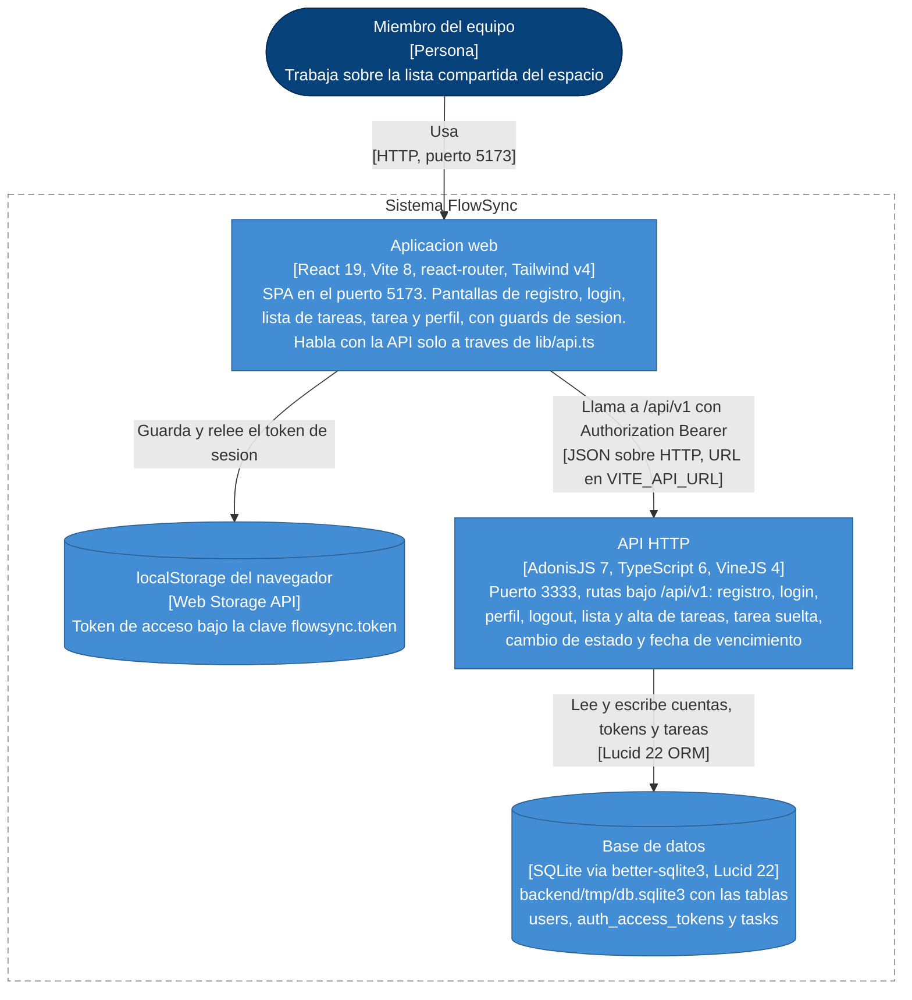

# Arquitectura de FlowSync

Este es el diagrama de contenedores de FlowSync —el nivel 2 del modelo C4—: las
piezas que se ejecutan por separado y cómo se hablan entre ellas. Son cuatro —la
SPA de React, la API de AdonisJS, el `localStorage` del navegador y el fichero
SQLite—, cada una con su tecnología entre corchetes y una línea de lo que hace,
y cada flecha con el protocolo por el que va. Se queda en el nivel de contenedor
y no descompone ninguno en componentes: los controladores, los modelos de Lucid
y los transformers viven dentro de la API y serían ya un diagrama de nivel 3.
Está dibujado con `flowchart` y no con el modo `C4Container` de Mermaid, que
sigue siendo experimental y falla en bastantes visores aunque su sintaxis sea
válida. Todo lo que aparece está verificado leyendo el repositorio:
`start/routes.ts` para los endpoints, `app/controllers/`, `app/models/`,
`app/transformers/` y `providers/api_provider.ts` para la forma de la API,
`config/database.ts` y `database/migrations/` para la capa de datos, y
`frontend/src/` para las pantallas, los guards, `lib/api.ts` y
`auth-provider.tsx`. No se dibuja nada que el código no sostenga: no hay
despliegue, ni cachés, ni servicios externos, ni colas, ni más base de datos que
el SQLite local.

