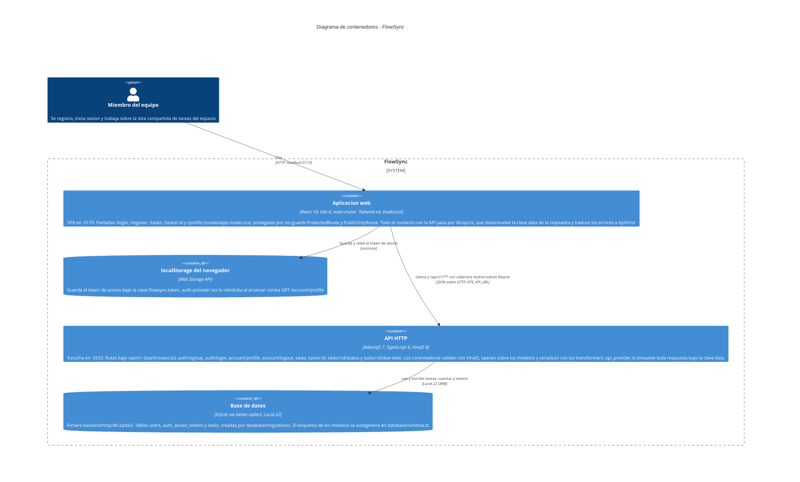

# Arquitectura de FlowSync

Este diagrama de contenedores (nivel 2 del modelo C4) muestra las piezas que se
despliegan y ejecutan por separado en FlowSync, y cómo se hablan entre ellas:
una SPA de React servida por Vite, una API HTTP de AdonisJS y un fichero SQLite.
Dentro de cada contenedor se indican los elementos reales del código que
determinan su forma —las rutas declaradas, los controladores, los modelos de
Lucid, los transformers y la capa de acceso a datos—, pero el diagrama se queda
en el nivel de contenedor y no descompone ninguno en componentes. Todo lo
dibujado está verificado leyendo el repositorio: `start/routes.ts`,
`app/controllers/`, `app/models/`, `app/transformers/`, `providers/api_provider.ts`,
`config/database.ts`, `database/migrations/` y `frontend/src/`. No aparece nada
que el código no sostenga: no hay despliegue, ni cachés, ni servicios externos,
ni colas, ni más base de datos que el SQLite local.

